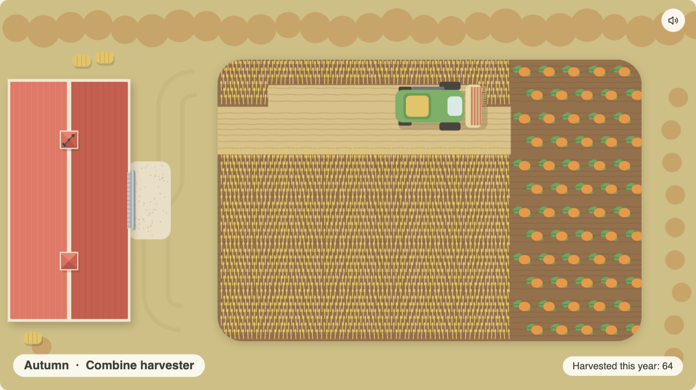
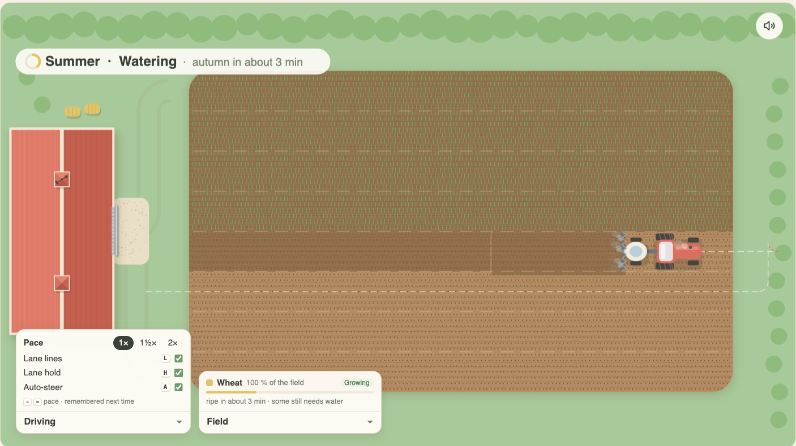
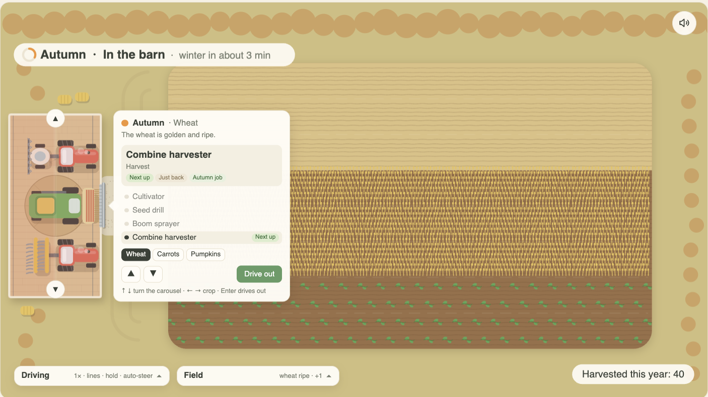

# Furrow

A calm, top-down farming sandbox to clear your mind while you wait for something else to finish.
There is one continuous field, a red barn, and a machine for every job. You drive slowly over the field with the arrow keys while the seasons turn.
There is no money, there are no goals, and nothing ever dies.



## Play

**Play it in your browser: https://thegallery.github.io/furrow/**

Or run it locally:

```sh
npm install
npm run dev      # open the printed local URL
```

`npm run build` writes a static build to `dist/`, and `npm run preview` serves it.

## Controls

| Key | Out on the field | In the barn |
| --- | --- | --- |
| ↑ | Drive forward | Turn the carousel up |
| ↓ | Brake, then reverse | Turn the carousel down |
| ← → | Steer (slowly when standing still) | Change the crop |
| Enter / Space | | Drive out with the machine at the door |
| − / = (or +) | Slower / faster pace | Slower / faster pace |
| L | Lane lines on or off | Lane lines on or off |
| H | Lane hold on or off | Lane hold on or off |
| A | Auto-steer on or off | Auto-steer on or off |

The arrow keys work as soon as the page loads; no click is needed. If the browser keeps the keyboard elsewhere (for example, the tab opened in the background or the address bar still has focus), the card at the top says "Click the field, then drive with the arrow keys", and one click on the field fixes it.

The dashboard in the bottom-right corner holds the same settings and stays in view, in the barn too. Its dial shows how fast the machine is going against the pace limit. Click a pace (1×, 1½× or 2×) to set it, or click a guide to switch it on or off; a lit lamp means the guide is on.

- **Pace**: 1× (the original speed), 1½× or 2×. A faster pace keeps the same turning circle.
- **Lane lines**: faint dashed lines along the lane edges, brighter while you drive on the field. While auto-steer drives, they also show the way it will go: soft dashes ahead, red where it will back up, and a dot where the implement meets the ground.
- **Lane hold**: while you are not steering, the machine straightens and settles onto the middle of the nearest lane, so passes sit side by side. Steering always wins.
- **Auto-steer**: hold ↑ and, once the machine is on the field, it works along the lane until the implement reaches the far edge, then makes a three-point turn into the next lane: it stops, backs round, pulls across and swings into the row, so the ends of the lanes are worked too. Let go of ↑ and it rolls to a stop, keeping its place. ← →, or backing up with ↓, take over at any time.

Lane lines and lane hold start on and auto-steer starts off. Furrow remembers the pace and each switch, and so does the mute button in the top-right corner.

The **Field** tab in the bottom-left corner shows what is planted. Click it to open the card: each crop, how much of the field it covers, its stage (sown, sprouting, growing, ripe or resting) and when it will be ripe, plus what is bare or ready for seed. Times are rounded, never ticking. It starts folded and folds itself while you are in the barn.

## How it plays

- **The field.** Work the ground by driving over it: the implement works whatever it passes over, a lane wide with a little overlap, so passes side by side leave no line between them.
  - The **cultivator** roughens bare ground.
  - The **planter** sows worked ground.
  - The **boom sprayer** waters what has been sown.
  - The **harvester** takes in the ripe crop and leaves stubble.
- **Growing.** Unwatered seed only sprouts. Once watered, a crop grows to ripe over about five minutes, and nothing grows in winter.
- **The barn.** Drive in through the roll-up door and stop:
  - The roof turns see-through.
  - Your machine turns round on the turntable.
  - The barn's machines wait on a carousel.

  The label by the door shows the season and what the field needs, and marks one machine **Next up**. Out-of-season machines are dimmed, but you can always pick them. You also choose the crop here.
- **Crops.** Each crop has its own planter and harvester:

  | Crop | Planter | Harvester |
  | --- | --- | --- |
  | Wheat | Seed drill | Combine harvester |
  | Carrots | Precision planter | Root harvester |
  | Pumpkins | Row planter | Tractor + trailer |

- **Seasons.** Spring, summer, autumn and winter each last about five minutes. The grass and hedges fade between them, and winter brings snow. The season pill in the top-left corner fills a soft ring through the season, says what you are doing and when the next season comes, e.g. "winter in about 3 min", and counts this year's harvest.
- **Sound.** Soft wind, the odd bird, and a quiet engine hum while you drive, all generated in the browser.
- **Saving.** Progress is kept in your browser's local storage and restored when you come back.




## Development

```sh
npm test           # Vitest: season clock, soil and growth, barn rules, carousel, arrow keys, driving, tyres, pace and guides, auto-steer coverage, what is planted, layout, save/load
npm run lint       # ESLint
npm run typecheck  # TypeScript
```

- `src/game/` holds the pure game logic. It has no DOM access and is unit-tested.
- `ZOOM` in `src/game/constants.ts` sets how large the farm is drawn, in screen pixels per world unit. Machines, the barn, plants, lanes and speeds are all in world units, so changing it rescales everything together and the field grows or shrinks to fill the view.
- `src/draw/` holds the canvas drawings: the field, the machines and the barn.
- `src/ui/` holds the barn label, the season pill, the dashboard and the field card.
- `src/audio.ts` holds the ambient sound.

## License

[MIT](LICENSE)
